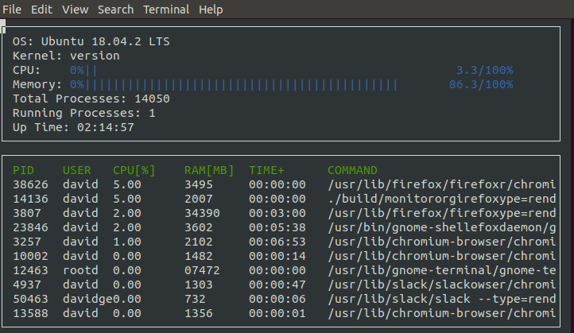

# linux-process-manager

A simple terminal-based process manager for Linux written in C++. 

## Features

* Dislays system OS and Kernel
* Shows overall % of CPU usage and RAM usage
* Counts total processes and running processes 
* Prints system's uptime
* Provides a list of all processes ordered high-to-low by memory usage
* Includes process information on user, CPU %, RAM usage, time spawned, and command issued

## Building 

This project uses CMake for building. The graphical terminal interface is implemented with ncurses. 

Clone the repository, `cd` into the directory, then execute `make build` to compile and `./build/monitor` to run. 

## Acknowledgements 

The project concept and ncurses boilerplate were provided by [Udacity](https://www.udacity.com/course/c-plus-plus-nanodegree--nd213).